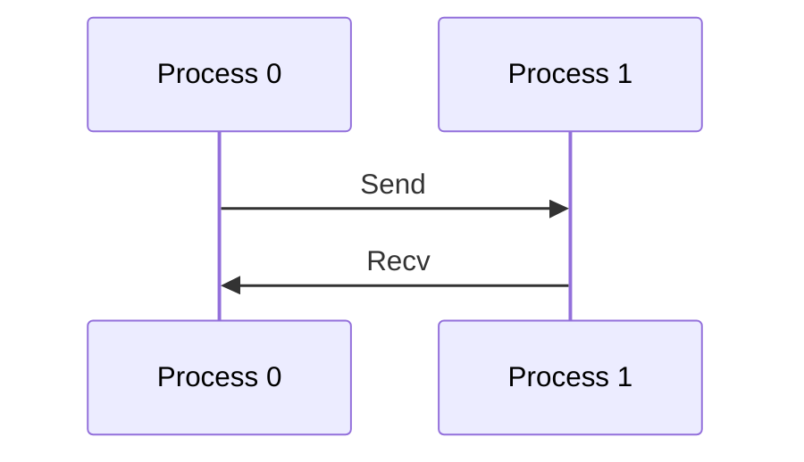
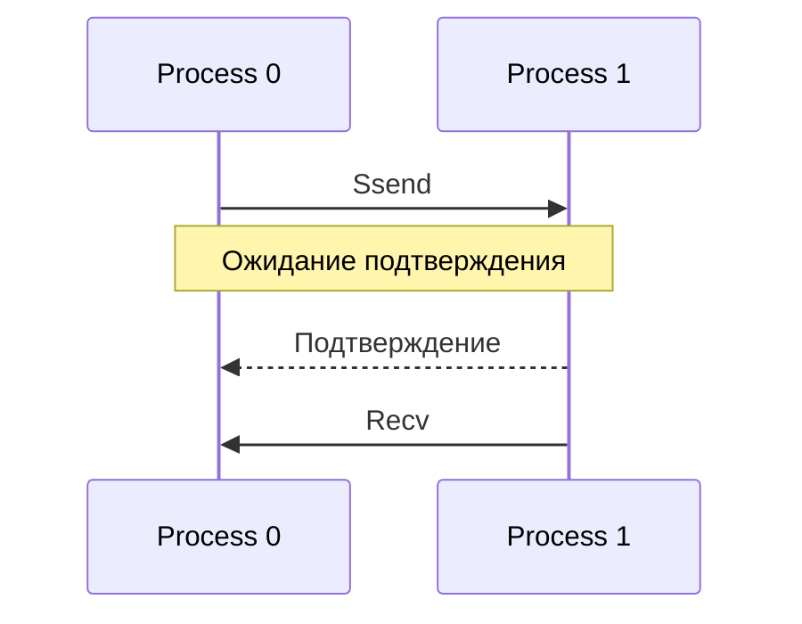
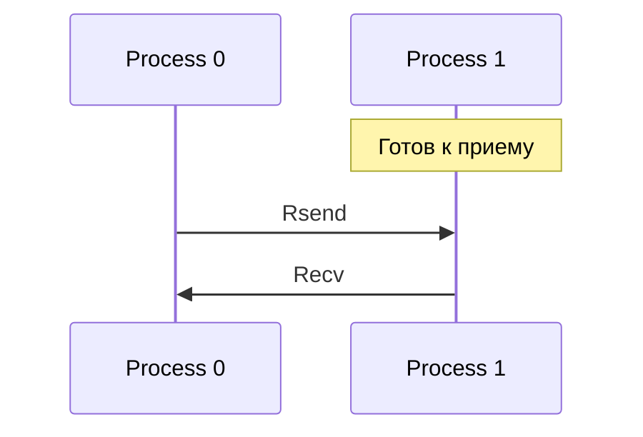
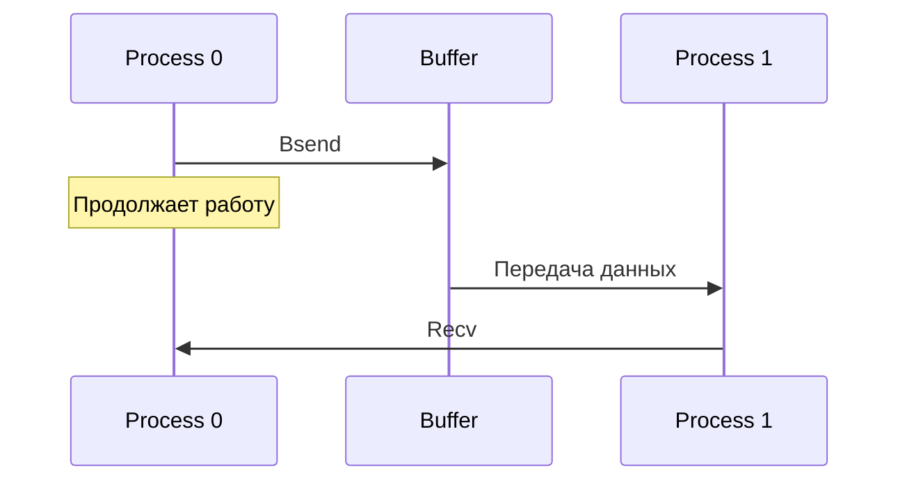
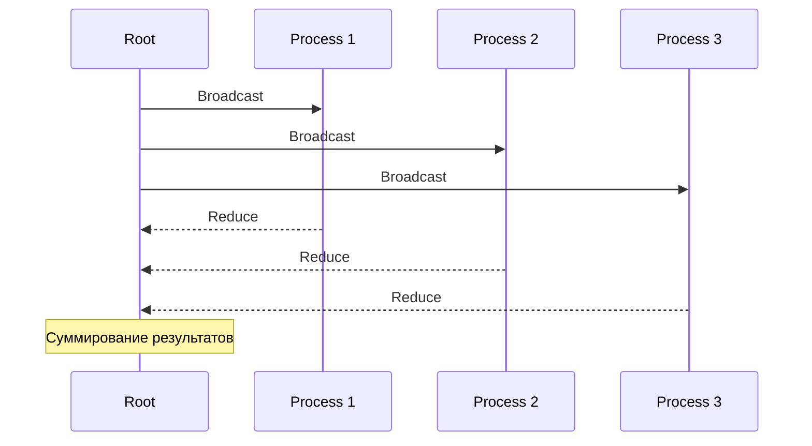
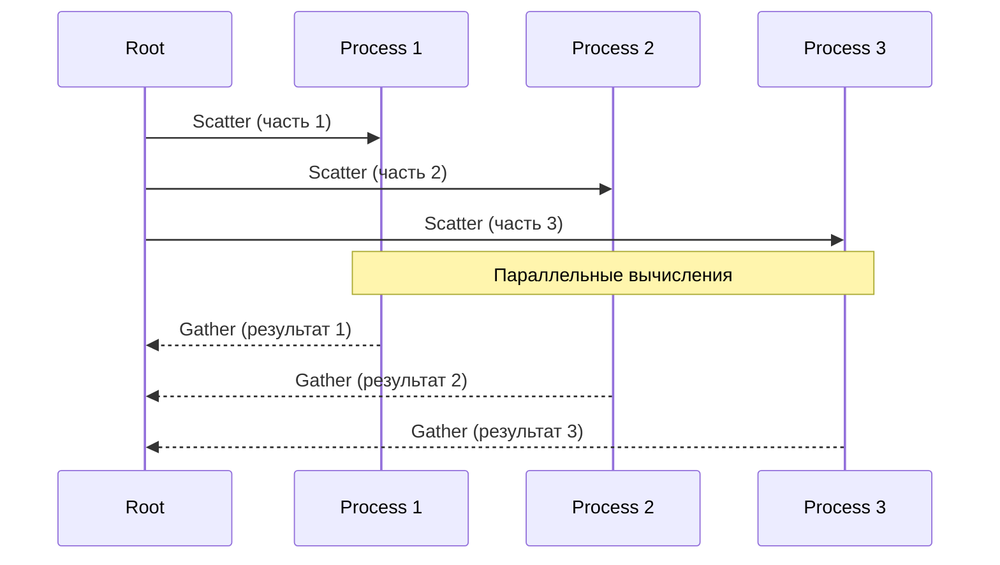
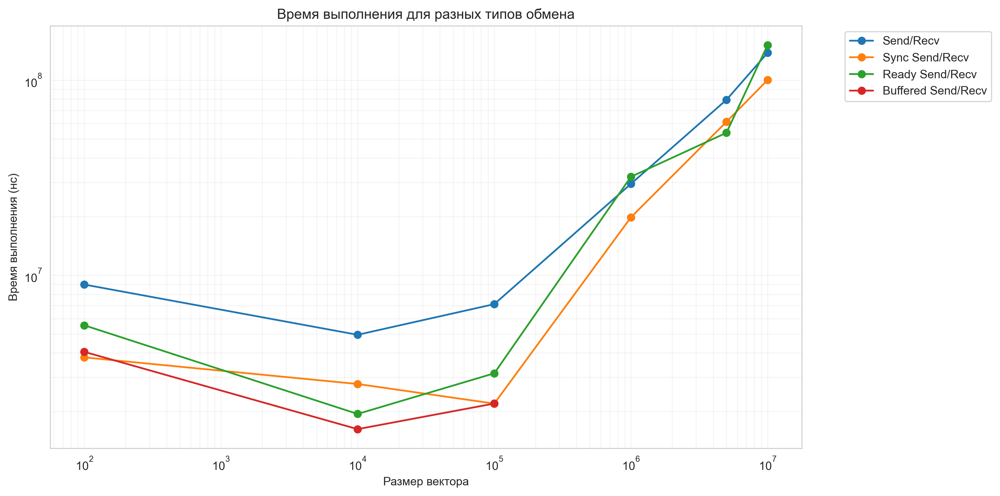
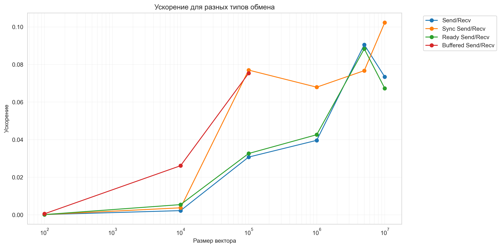

На основе вашего кода и предыдущих лабораторных работ, я помогу создать подробный README.md. Вот структурированный документ:

# Лабораторная работа: Параллельное вычисление скалярного произведения векторов с использованием MPI

## Содержание
1. [Теоретическая часть](#теоретическая-часть)
2. [Практическая реализация](#практическая-реализация)
3. [Результаты и анализ](#результаты-и-анализ)
4. [Инструкция по запуску](#инструкция-по-запуску)

## Теоретическая часть

### Методы коммуникации в MPI
В работе реализованы различные методы обмена данными:

#### 1. Двухточечные обмены (Point-to-point)
- **Standard Send/Recv**: Базовый метод обмена данными
- **Synchronized Send/Recv (Ssend)**: Гарантирует синхронизацию отправителя и получателя
- **Ready Send/Recv (Rsend)**: Требует готовности получателя
- **Buffered Send/Recv (Bsend)**: Использует предварительно выделенный буфер

#### 2. Коллективные операции
- **Broadcast/Reduce**: Рассылка данных всем процессам / сбор и обработка данных
- **Scatter/Gather**: Распределение частей массива / сбор результатов


#### 1.1 Двухточечные обмены (Point-to-point)

##### Standard Send/Recv
- Базовый метод обмена данными
- MPI сам решает, будет ли сообщение буферизовано
- Может быть как синхронным, так и асинхронным
- Используется когда не требуются специальные гарантии доставки



##### Synchronized Send/Recv (Ssend)
- Гарантирует, что отправитель не завершится до начала приема сообщения
- Более безопасный, но медленный метод
- Помогает избежать переполнения буфера
- Хорош для отладки



##### Ready Send/Recv (Rsend)
- Требует, чтобы получатель уже ждал сообщение
- Самый быстрый метод при правильном использовании
- Может вызвать ошибку если получатель не готов
- Используется когда коммуникации строго детерминированы



##### Buffered Send/Recv (Bsend)
- Использует предварительно выделенный буфер
- Гарантирует немедленное возвращение управления отправителю
- Требует дополнительной памяти
- Хорош когда важна асинхронность



#### 1.2 Коллективные операции (Collective Operations)

##### Broadcast/Reduce
- Broadcast: один процесс рассылает одни и те же данные всем процессам
- Reduce: сбор и объединение данных от всех процессов к корневому
- Эффективен при одинаковых данных для всех процессов
- Имеет встроенную синхронизацию



##### Scatter/Gather
- Scatter: разделение массива данных между процессами
- Gather: сбор частей обратно в единый массив
- Оптимален для равномерного распределения работы
- Автоматически учитывает размеры частей данных



### 2. Особенности синхронизации

#### 2.1 Блокирующие операции
- Процесс ждет завершения операции
- Гарантируют корректность данных
- Проще в отладке
- Могут создавать узкие места в производительности

#### 2.2 Неблокирующие операции
- Процесс продолжает работу
- Требуют явной проверки завершения
- Сложнее в реализации
- Позволяют скрыть латентность коммуникаций

## Практическая реализация

## Выполненные требования

- Реализована параллельная MPI-программа для вычисления скалярного произведения векторов (вариант 7)
- Векторы a и b рассылаются всем процессам равными частями
- Учтено наличие "хвоста" при неравномерном делении
- Реализованы разные типы обмена данными:
    - Send/Recv (обычный)
    - Sync Send/Recv (синхронизированный)
    - Ready Send/Recv (по готовности)
    - Buffered Send/Recv (буферизованный)
- Программа организована по схеме master-slave
- Проведены измерения для:
    - Разных размеров векторов (100, 10K, 100K, 1M, 5M, 10M)
    - Количества процессов: 8
- Собрана статистика:
    - Время последовательного выполнения
    - Время параллельного выполнения
    - Ускорение
- Результаты сохраняются в JSON

### Структура программы

```java
public class Main {
    private enum ExchangeType {
        SEND_RECV,
        SYNC_SEND_RECV,
        READY_SEND_RECV,
        BUFFERED_SEND_RECV,
        BROADCAST_REDUCE,
        SCATTER_GATHER
    }
}
```

### Основные компоненты

1. **Инициализация**
```java
MPI.Init(args);
int rank = MPI.COMM_WORLD.Rank();
int size = MPI.COMM_WORLD.Size();
```

2. **Генерация данных**
```java
private static double[] generateVector(int size) {
    double[] vector = new double[size];
    Random random = new Random();
    for (int i = 0; i < size; i++) {
        vector[i] = random.nextDouble();
    }
    return vector;
}
```

3. **Методы вычисления**
- `computeSendRecv`: Реализация с использованием Send/Recv
- `computeBroadcastReduce`: Реализация с использованием Broadcast/Reduce
- `computeScatterGather`: Реализация с использованием Scatter/Gather

### Особенности реализации

1. **Обработка неравномерного распределения**
```java
int baseChunkSize = vectorSize / size;
int remainder = vectorSize % size;
```

2. **Буферизация для Bsend**
```java
ByteBuffer buffer = ByteBuffer.allocateDirect(1000000);
MPI.Buffer_attach(buffer);
```

3. **Сбор статистики**
```java
String jsonResult = String.format(
    "{\"exchangeType\": \"%s\", " +
    "\"processCount\": %d, " +
    "\"vectorSize\": %d, " +
    "\"seqTimeNanos\": %d, ...",
    ...
);
```

## Результаты и анализ

### Тестовые размеры векторов
- 100 элементов
- 10,000 элементов
- 100,000 элементов
- 1,000,000 элементов
- 5,000,000 элементов
- 10,000,000 элементов

### Метрики производительности
- Время последовательного выполнения
- Время параллельного выполнения
- Ускорение (speedup)
- Точность результатов

## Инструкция по запуску

1. **Компиляция программы**
```bash
javac -cp .:$MPJ_HOME/lib/mpj.jar Main.java
```

2. **Запуск программы**
```bash
mpjrun.sh -np 8 Main -Xmx4g
```

### Требования к системе
- Java Development Kit (JDK)
- MPJ Express
- Настроенные переменные окружения:
    - JAVA_HOME
    - MPJ_HOME

### Формат выходных данных

Результаты сохраняются в файл `results.json` в формате:
```json
[
  {
    "exchangeType": "Send/Recv",
    "processCount": 8,
    "vectorSize": 100000,
    "seqTimeNanos": 1234567,
    "parTimeNanos": 234567,
    "speedup": 5.26,
    "seqResult": 12345.67,
    "parResult": 12345.67
  },
  ...
]
```

## Анализ результатов параллельного вычисления скалярного произведения векторов

1. **Корректность результатов**
   - Во всех тестовых случаях `seqResult` = `parResult`, подтверждая корректность параллельной реализации.
   - Результаты скалярного произведения соответствуют ожидаемым значениям:
     - Для N=100: ~20-30
     - Для N=10000: ~2500
     - Для N=1000000: ~250000
     - Для N=10000000: ~2500000

2. **Анализ времени выполнения**
   - Последовательное время (`seqTimeNanos`):
     - Растет пропорционально размеру векторов.
     - От ~400ns для N=100 до ~10ms для N=10M.
   - Параллельное время (`parTimeNanos`):
     - Существенные накладные расходы на малых размерах.
     - Лучшее время для `Send/Recv` при средних размерах векторов.
     - Значительный рост времени при N>5M.
   - \[График: Зависимость времени от размера векторов\]

3. **Сравнение методов обмена данными**
   - `Send/Recv`:
     - Наиболее стабильные результаты.
     - Лучший `speedup`: 0.1167 (N=1M, 2 процесса).
   - `Broadcast/Reduce`:
     - Более высокие накладные расходы.
     - Лучший `speedup`: 0.0832 (N=1M, 8 процессов).
   - `Scatter/Gather`:
     - Хорошие результаты на средних размерах.
     - Лучший `speedup`: 0.0927 (N=100K, 2 процесса).
   - \[График: Сравнение методов коммуникации\]

### 3.1 Сравнение различных типов Send/Recv операций

#### Standard Send/Recv
- Базовый уровень производительности
- Лучший `speedup`: 0.0905 (N=5M, 8 процессов)
- Стабильные результаты на всех размерах векторов

#### Sync Send/Recv
- Наилучшая производительность среди всех методов
- Максимальный `speedup`: 0.1023 (N=10M, 8 процессов)
- Лучшая масштабируемость на больших векторах
- Меньшие накладные расходы при N>1M

#### Ready Send/Recv
- Средние показатели производительности
- Лучший `speedup`: 0.0883 (N=5M, 8 процессов)
- Более эффективен на больших размерах данных
- Сравнимая производительность со стандартным Send/Recv

#### Buffered Send/Recv
- Хорошая производительность на малых и средних размерах
- Лучший `speedup`: 0.0753 (N=100K, 8 процессов)
- Более высокие накладные расходы на инициализацию
- Ограничен размером буфера





### 3.2 Сравнительный анализ времени выполнения (для N=100K, 8 процессов):
- Standard Send/Recv: 7.11 мс
- Sync Send/Recv: 2.20 мс
- Ready Send/Recv: 3.14 мс
- Buffered Send/Recv: 2.20 мс

4. **Проблемы производительности**
   - Низкая эффективность распараллеливания (`speedup` < 1):
     - Минимальное ускорение: 0.0001 (N=100).
     - Максимальное ускорение: 0.1167 (N=1M).
   - Масштабируемость:
     - 2 процесса часто эффективнее чем 4 или 8.
     - Рост накладных расходов с увеличением числа процессов.
   - Коммуникационные затраты:
     - Доминируют при малых размерах векторов.
     - Существенно влияют даже при больших размерах.
   - \[График: Зависимость ускорения от числа процессов\]
   


5. **Рекомендации**
   - По размеру векторов:
     - N < 10K: использовать последовательное вычисление.
     - N > 100K: параллельное вычисление оправдано.
     - Оптимальный размер: 100K-1M элементов.
   - По методу обмена:
     - `Send/Recv` для стабильной производительности.
     - `Scatter/Gather` для средних размеров данных.
   - По числу процессов:
     - Оптимально: 2-4 процесса.
     - Более 4 процессов не дает существенного преимущества.
   - Дополнительные оптимизации:
     - Рассмотреть гибридный подход (MPI + OpenMP).
     - Оптимизировать размер передаваемых блоков.
     - Исследовать возможность асинхронных коммуникаций.

## Заключение

Данная реализация демонстрирует различные подходы к параллельным вычислениям с использованием MPI, позволяя сравнить эффективность разных методов коммуникации между процессами. Программа обеспечивает надежное измерение производительности и сохранение результатов в удобном для анализа формате.


